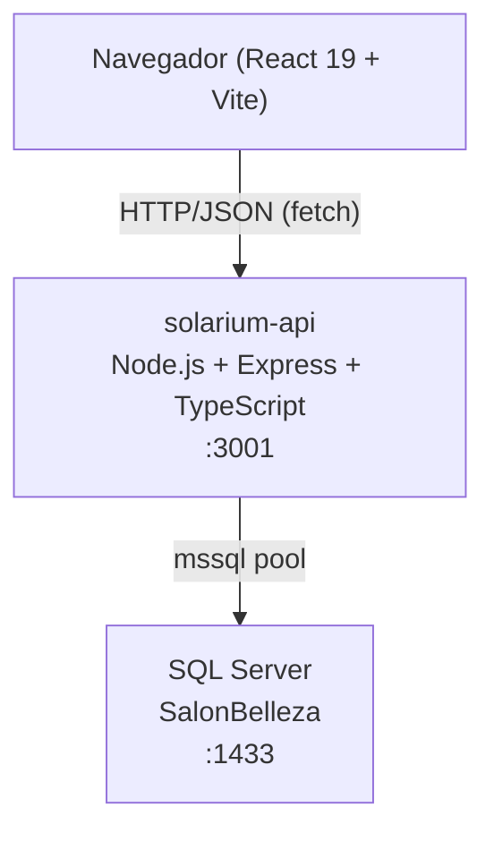

# Documento de Diseño Técnico — Solarium Backend Redesign

## Visión General

El proyecto transforma el sitio web estático de Solarium en una aplicación full-stack. El frontend React existente (con datos hardcodeados) se conectará a un nuevo backend Node.js/Express/TypeScript que expone una API REST, la cual a su vez consulta la base de datos SQL Server `SalonBelleza` ya existente.

Los dos grandes ejes del trabajo son:

1. **Backend nuevo** (`solarium-api/`): servidor Express con TypeScript, pool de conexiones `mssql`, rutas organizadas por recurso, y ejecución de stored procedures existentes.
2. **Refactorización del frontend** (`Solarium/`): consolidación de CSS, componentización de `App.tsx`, consumo de la API con estados de carga/error, y mejoras visuales premium.

---

## Arquitectura



### Decisiones de arquitectura

- **Separación de repositorios en monorepo**: `Solarium/` y `solarium-api/` conviven en el mismo repositorio pero son proyectos independientes con sus propios `package.json`.
- **API REST versionada**: prefijo `/api/v1` para facilitar futuras versiones sin romper clientes existentes.
- **Pool de conexiones**: `mssql` gestiona un pool de conexiones reutilizables; no se abre/cierra una conexión por request.
- **Variables de entorno**: todas las credenciales y configuraciones sensibles se leen de `.env` mediante `dotenv`; nunca se hardcodean.
- **CORS explícito**: el backend permite peticiones únicamente desde el origen del frontend (configurable por variable de entorno).

---

## Componentes e Interfaces

### Backend — `solarium-api/`

```
solarium-api/
├── src/
│   ├── db/
│   │   └── pool.ts          # Configuración y singleton del pool mssql
│   ├── routes/
│   │   ├── servicios.ts     # GET /api/v1/servicios, /categorias, /servicios/categoria/:id
│   │   ├── empleados.ts     # GET /api/v1/empleados
│   │   ├── reservas.ts      # POST /api/v1/reservas, PATCH /api/v1/reservas/:id/estado, GET /api/v1/reservas
│   │   └── clientes.ts      # GET /api/v1/clientes/buscar
│   ├── controllers/
│   │   ├── serviciosController.ts
│   │   ├── empleadosController.ts
│   │   ├── reservasController.ts
│   │   └── clientesController.ts
│   ├── types/
│   │   └── index.ts         # Tipos TypeScript compartidos
│   └── app.ts               # Configuración Express (middlewares, rutas)
├── index.ts                 # Entry point: inicia pool y levanta servidor
├── .env.example
├── tsconfig.json
├── package.json
└── README.md
```

### Frontend — `Solarium/src/`

```
Solarium/src/
├── components/
│   ├── Navbar.tsx
│   ├── Hero.tsx
│   ├── SeccionServicios.tsx   # Consume GET /api/v1/servicios
│   ├── SeccionEquipo.tsx      # Consume GET /api/v1/empleados
│   ├── SeccionTestimonios.tsx
│   ├── FormularioReserva.tsx  # Consume POST /api/v1/reservas
│   ├── Galeria.tsx
│   ├── Contacto.tsx
│   ├── BotonReservaFijo.tsx   # Botón flotante de reserva
│   └── ui/
│       ├── SkeletonCard.tsx   # Indicador de carga
│       └── MensajeError.tsx   # Mensaje de error amigable
├── hooks/
│   ├── useServicios.ts        # Fetching + estado de servicios
│   └── useEmpleados.ts        # Fetching + estado de empleados
├── types/
│   └── api.ts                 # Tipos TypeScript del dominio
├── App.tsx                    # Composición de secciones
├── index.css                  # Estilos globales (único archivo CSS)
└── main.tsx
```

### Interfaces de la API REST

| Método | Ruta | Descripción |
|--------|------|-------------|
| GET | `/api/v1/servicios` | Lista servicios activos |
| GET | `/api/v1/servicios/categoria/:id` | Servicios por categoría (SP) |
| GET | `/api/v1/categorias` | Lista categorías activas |
| GET | `/api/v1/empleados` | Empleados activos (SP) |
| POST | `/api/v1/reservas` | Crear reserva (SP) |
| PATCH | `/api/v1/reservas/:id/estado` | Cambiar estado (SP) |
| GET | `/api/v1/reservas` | Reservas por rango de fechas (SP) |
| GET | `/api/v1/clientes/buscar` | Buscar cliente por nombre (SP) |

---

## Modelos de Datos

### Tipos TypeScript — Backend (`src/types/index.ts`)

```typescript
// Entidades de la BD
export interface Categoria {
  id_categoria: number;
  nombre: string;
  descripcion: string | null;
  activo: boolean;
}

export interface Servicio {
  id_servicio: number;
  id_categoria: number;
  nombre: string;
  descripcion: string | null;
  duracion_min: number;
  precio: number;
  categoria: string;
}

export interface Empleado {
  id_empleado: number;
  nombre: string;
  apellido: string;
  especialidad: string | null;
}

export interface Cliente {
  id_cliente: number;
  nombre: string;
  apellido: string;
  telefono: string | null;
  email: string | null;
}

export interface Reserva {
  id_trabajo: number;
  cliente: string;
  empleado: string;
  servicio: string;
  fecha_reserva: string;
  estado: EstadoReserva;
  precio_cobrado: number | null;
}

export type EstadoReserva =
  | 'PENDIENTE'
  | 'CONFIRMADO'
  | 'EN_PROCESO'
  | 'COMPLETADO'
  | 'CANCELADO';

// Parámetros de stored procedures
export interface ParamsCrearReserva {
  id_cliente: number;
  id_empleado: number;
  id_servicio: number;
  fecha_reserva: Date;
  observaciones?: string;
}

export interface ParamsCambiarEstado {
  id_trabajo: number;
  nuevo_estado: EstadoReserva;
}

// Request bodies
export interface BodyCrearReserva {
  nombre: string;
  apellido: string;
  email: string;
  telefono: string;
  id_servicio: number;
  id_empleado: number;
  fecha_reserva: string; // YYYY-MM-DD
  hora_reserva: string;  // HH:MM
  observaciones?: string;
}

// Respuestas de la API
export interface ApiError {
  error: string;
}

export interface ApiSuccess<T> {
  data: T;
}
```

### Tipos TypeScript — Frontend (`src/types/api.ts`)

```typescript
export interface Servicio {
  id_servicio: number;
  nombre: string;
  descripcion: string | null;
  duracion_min: number;
  precio: number;
  categoria: string;
}

export interface Empleado {
  id_empleado: number;
  nombre: string;
  apellido: string;
  especialidad: string | null;
}

export interface FormularioReservaData {
  nombre: string;
  apellido: string;
  email: string;
  telefono: string;
  id_servicio: number | '';
  id_empleado: number | '';
  fecha_reserva: string;
  hora_reserva: string;
}

export type EstadoReserva =
  | 'PENDIENTE'
  | 'CONFIRMADO'
  | 'EN_PROCESO'
  | 'COMPLETADO'
  | 'CANCELADO';

export interface ReservaCreada {
  id_trabajo: number;
  mensaje: string;
}
```

### Esquema de la BD (referencia)

Las tablas relevantes de `SalonBelleza` son:

| Tabla | Columnas clave |
|-------|---------------|
| `Categoria` | `id_categoria`, `nombre`, `activo` |
| `Servicio` | `id_servicio`, `id_categoria`, `nombre`, `descripcion`, `duracion_min`, `precio`, `activo` |
| `Empleado` | `id_empleado`, `nombre`, `apellido`, `especialidad`, `activo` |
| `Cliente` | `id_cliente`, `nombre`, `apellido`, `telefono`, `email` |
| `Trabajo` | `id_trabajo`, `id_cliente`, `id_empleado`, `id_servicio`, `fecha_reserva`, `estado`, `precio_cobrado` |
| `Bitacora` | `id_bitacora`, `tabla_afectada`, `tipo_operacion`, `detalle`, `fecha_hora` |

### Shapes de Request/Response

**POST /api/v1/reservas**
```json
// Request body
{
  "nombre": "Ana",
  "apellido": "Torres",
  "email": "ana@email.com",
  "telefono": "70000001",
  "id_servicio": 2,
  "id_empleado": 1,
  "fecha_reserva": "2025-08-15",
  "hora_reserva": "10:00",
  "observaciones": "Primera visita"
}

// Response 201
{ "id_trabajo": 6, "mensaje": "Reserva creada exitosamente" }

// Response 400
{ "error": "El campo 'email' es requerido" }

// Response 422
{ "error": "El servicio seleccionado no está disponible" }
```

**PATCH /api/v1/reservas/:id/estado**
```json
// Request body
{ "estado": "CONFIRMADO" }

// Response 200
{ "id_trabajo": 6, "estado": "CONFIRMADO" }

// Response 422
{ "error": "Estado inválido. Valores permitidos: PENDIENTE, CONFIRMADO, EN_PROCESO, COMPLETADO, CANCELADO" }
```

**GET /api/v1/reservas?fecha_inicio=2025-08-01&fecha_fin=2025-08-31**
```json
// Response 200
[
  {
    "id_trabajo": 1,
    "cliente": "Ana Torres",
    "empleado": "María López",
    "servicio": "Tinte completo",
    "fecha_reserva": "2025-08-10T09:00:00.000Z",
    "estado": "COMPLETADO",
    "precio_cobrado": 350.00
  }
]
```

---

## Estrategia de Conexión a SQL Server

### Pool de conexiones (`src/db/pool.ts`)

```typescript
import sql from 'mssql';

const config: sql.config = {
  server: process.env.DB_HOST!,
  port: parseInt(process.env.DB_PORT ?? '1433'),
  database: process.env.DB_NAME!,
  user: process.env.DB_USER!,
  password: process.env.DB_PASSWORD!,
  options: {
    encrypt: false,           // true si se usa Azure
    trustServerCertificate: true,
  },
  pool: {
    max: 10,
    min: 2,
    idleTimeoutMillis: 30_000,
  },
};

let pool: sql.ConnectionPool | null = null;

export async function getPool(): Promise<sql.ConnectionPool> {
  if (!pool) {
    pool = await new sql.ConnectionPool(config).connect();
  }
  return pool;
}
```

El pool se inicializa una sola vez al arrancar el servidor (`index.ts`). Si la conexión falla en el arranque, el proceso termina con `process.exit(1)`.

### Patrón de uso en controllers

```typescript
const pool = await getPool();
const result = await pool.request()
  .input('id_categoria', sql.Int, idCategoria)
  .execute('sp_ListarServiciosPorCategoria');
return result.recordset;
```

### Variables de entorno (`.env.example`)

```
DB_HOST=localhost
DB_PORT=1433
DB_NAME=SalonBelleza
DB_USER=sa
DB_PASSWORD=tu_password_aqui
PORT=3001
CORS_ORIGIN=http://localhost:5173
```

---

## Diseño Visual Premium

### Paleta de colores

| Token | Valor | Uso |
|-------|-------|-----|
| `--color-dorado` | `#C9A84C` | Acentos, CTAs, precios |
| `--color-champagne` | `#F5E6C8` | Fondos suaves, hover states |
| `--color-negro` | `#0D0D0D` | Texto principal, navbar |
| `--color-marfil` | `#FAF7F2` | Fondo de secciones alternas |
| `--color-gris-suave` | `#6B6B6B` | Texto secundario |

### Tipografía

- **Títulos** (`h1`–`h3`): `Playfair Display` (serif, Google Fonts) — transmite elegancia y lujo.
- **Cuerpo y UI**: `Inter` (sans-serif) — legibilidad en pantalla.
- Carga mediante `@import` en `index.css`.

### Componentes UI clave

- **Hero**: imagen de fondo real (`hero.png` existente) con overlay oscuro semitransparente + gradiente dorado en el CTA.
- **Tarjetas de servicio**: borde dorado sutil en hover, precio en `--color-dorado`.
- **Skeleton loader**: rectángulos animados con `animate-pulse` de Tailwind mientras carga la API.
- **Botón flotante**: posición `fixed bottom-6 right-6`, fondo dorado, sombra pronunciada, visible en scroll.
- **Animaciones de entrada**: `IntersectionObserver` en cada sección para aplicar clase `visible` que activa `fadeInUp`.

### Consolidación CSS

`App.css` se vacía completamente. Todos los estilos base (scroll-behavior, body, animaciones, scrollbar, focus) permanecen únicamente en `index.css`. Las variables de color se definen en `:root` dentro de `index.css`.

---

## Manejo de Errores

### Backend

- **Errores de validación (400)**: middleware de validación en cada controller verifica campos requeridos antes de tocar la BD.
- **Errores de negocio (422)**: validaciones de existencia (servicio activo, empleado activo, estado válido) retornan 422 con mensaje descriptivo.
- **No encontrado (404)**: cuando un `id` no existe en la BD (ej. reserva inexistente para PATCH).
- **Error interno (500)**: bloque `try/catch` en todos los controllers; el error se loguea en consola y se responde `{ error: "Error interno del servidor" }` sin exponer detalles de la BD.
- **Fallo de conexión al arranque**: si `getPool()` lanza en `index.ts`, se captura, se loguea y se llama `process.exit(1)`.

### Frontend

- **Estado de carga**: hooks `useServicios` y `useEmpleados` exponen `{ data, loading, error }`.
- **Skeleton**: mientras `loading === true`, se renderizan `SkeletonCard` en lugar de las tarjetas reales.
- **Mensaje de error**: si `error !== null`, se muestra `<MensajeError>` con texto amigable; el resto de la página sigue funcionando.
- **Formulario**: el botón de envío se deshabilita con `disabled={submitting}` durante la petición; los errores de la API se muestran inline sin recargar la página.

---

## Estrategia de Testing

### Enfoque dual

Se utilizan dos tipos de tests complementarios:

- **Tests unitarios/de integración**: verifican ejemplos concretos, casos borde y condiciones de error.
- **Tests de propiedades (PBT)**: verifican propiedades universales sobre rangos amplios de entradas generadas aleatoriamente.

### Herramientas

| Capa | Framework de test | Librería PBT |
|------|------------------|--------------|
| Backend (Node.js/TS) | Vitest | `fast-check` |
| Frontend (React/TS) | Vitest + React Testing Library | `fast-check` |

### Configuración PBT

- Mínimo **100 iteraciones** por propiedad (configurado con `fc.assert(fc.property(...), { numRuns: 100 })`).
- Cada test de propiedad incluye un comentario de trazabilidad:
  ```typescript
  // Feature: solarium-backend-redesign, Property N: <texto de la propiedad>
  ```

### Tests unitarios (ejemplos y casos borde)

- Validación de campos requeridos en `POST /api/v1/reservas` con body vacío.
- Respuesta 404 cuando se hace PATCH a un `id_trabajo` inexistente.
- Combinación correcta de `fecha_reserva` + `hora_reserva` en un `DATETIME`.
- Renderizado de `SkeletonCard` cuando `loading === true`.
- Renderizado de `MensajeError` cuando `error !== null`.
- Formulario deshabilitado durante el envío.

### Tests de propiedades

Ver sección **Propiedades de Corrección** a continuación.


---

## Propiedades de Corrección

*Una propiedad es una característica o comportamiento que debe mantenerse verdadero en todas las ejecuciones válidas del sistema — esencialmente, una declaración formal sobre lo que el sistema debe hacer. Las propiedades sirven como puente entre las especificaciones legibles por humanos y las garantías de corrección verificables por máquinas.*

---

### Propiedad 1: Solo se retornan registros activos en los listados

*Para cualquier* conjunto de datos en la BD, cuando se llama a `GET /api/v1/servicios`, `GET /api/v1/categorias` o `GET /api/v1/empleados`, todos los elementos del arreglo retornado deben tener `activo = 1` (o `activo = true`); ningún registro inactivo debe aparecer en la respuesta.

**Valida: Requisitos 4.1, 4.5, 5.1**

---

### Propiedad 2: Las respuestas contienen todos los campos requeridos

*Para cualquier* elemento retornado por los endpoints de listado, el objeto JSON debe contener exactamente los campos especificados para ese recurso:
- Servicio: `id_servicio`, `nombre`, `descripcion`, `duracion_min`, `precio`, `categoria`
- Empleado: `id_empleado`, `nombre`, `apellido`, `especialidad`
- Cliente (búsqueda): `id_cliente`, `nombre`, `apellido`, `telefono`, `email`
- Reserva: `id_trabajo`, `cliente`, `empleado`, `servicio`, `fecha_reserva`, `estado`, `precio_cobrado`

**Valida: Requisitos 4.2, 5.2, 7.5, 8.7**

---

### Propiedad 3: El filtrado por categoría retorna solo servicios de esa categoría

*Para cualquier* `id_categoria` válido, todos los servicios retornados por `GET /api/v1/servicios/categoria/:id` deben pertenecer a esa categoría; ningún servicio de otra categoría debe aparecer en la respuesta.

**Valida: Requisito 4.3**

---

### Propiedad 4: Todos los endpoints están bajo el prefijo `/api/v1`

*Para cualquier* ruta registrada en el servidor Express, su path completo debe comenzar con `/api/v1`; no debe existir ningún endpoint accesible fuera de ese prefijo.

**Valida: Requisito 3.1**

---

### Propiedad 5: Todas las respuestas incluyen cabeceras CORS

*Para cualquier* solicitud HTTP enviada al backend (independientemente del método, ruta o cuerpo), la respuesta debe incluir la cabecera `Access-Control-Allow-Origin` con el valor configurado en `CORS_ORIGIN`.

**Valida: Requisito 3.4**

---

### Propiedad 6: Los errores internos retornan HTTP 500 con cuerpo `{ error }`

*Para cualquier* endpoint que lance una excepción no controlada durante su ejecución, la respuesta debe tener código HTTP 500 y un cuerpo JSON con la clave `error` cuyo valor es un string no vacío.

**Valida: Requisito 3.6**

---

### Propiedad 7: Los parámetros inválidos o faltantes retornan HTTP 400 con cuerpo `{ error }`

*Para cualquier* solicitud a la API que omita un campo requerido o incluya un parámetro con formato inválido, la respuesta debe tener código HTTP 400 y un cuerpo JSON con la clave `error` cuyo valor describe el campo o parámetro problemático.

**Valida: Requisitos 3.7, 6.4, 8.2, 8.8**

---

### Propiedad 8: Los componentes de listado renderizan exactamente N tarjetas dado un array de N elementos

*Para cualquier* array de N servicios, empleados u opciones de selector, el componente correspondiente (`SeccionServicios`, `SeccionEquipo`, `FormularioReserva`) debe renderizar exactamente N tarjetas u opciones en el DOM; ni más ni menos.

**Valida: Requisitos 4.6, 5.3, 6.11, 6.12**

---

### Propiedad 9: La combinación de fecha y hora produce un DATETIME válido

*Para cualquier* par de strings con formato `fecha_reserva = "YYYY-MM-DD"` y `hora_reserva = "HH:MM"`, la función de combinación del backend debe producir un objeto `Date` válido (no `Invalid Date`) cuya fecha y hora correspondan exactamente a los valores de entrada.

**Valida: Requisito 6.7**

---

### Propiedad 10: El botón de envío está deshabilitado durante la solicitud en curso

*Para cualquier* estado del formulario de reserva donde `submitting = true`, el botón de envío debe tener el atributo `disabled`; cuando `submitting = false`, el botón debe estar habilitado.

**Valida: Requisito 6.9**

---

### Propiedad 11: Un email ya registrado reutiliza el `id_cliente` existente

*Para cualquier* solicitud de reserva cuyo campo `email` ya existe en la tabla `Cliente`, el `id_cliente` utilizado al invocar `sp_CrearReserva` debe ser el `id_cliente` del registro existente; no debe crearse un nuevo registro en `Cliente`.

**Valida: Requisito 7.1**

---

### Propiedad 12: Un email nuevo crea exactamente un registro en `Cliente`

*Para cualquier* solicitud de reserva cuyo campo `email` no existe en la tabla `Cliente`, después de procesar la solicitud debe existir exactamente un nuevo registro en `Cliente` con los datos proporcionados (`nombre`, `apellido`, `telefono`, `email`).

**Valida: Requisito 7.2**

---

### Propiedad 13: La búsqueda de clientes retorna solo coincidencias con el texto buscado

*Para cualquier* texto de búsqueda `q` no vacío, todos los clientes retornados por `GET /api/v1/clientes/buscar?q=:texto` deben tener el texto `q` contenido (case-insensitive) en su campo `nombre` o en su campo `apellido`; ningún cliente sin coincidencia debe aparecer en los resultados.

**Valida: Requisito 7.3**

---

### Propiedad 14: Un estado inválido en PATCH retorna HTTP 422

*Para cualquier* string que no sea uno de los valores válidos de `EstadoReserva` (`PENDIENTE`, `CONFIRMADO`, `EN_PROCESO`, `COMPLETADO`, `CANCELADO`), la solicitud `PATCH /api/v1/reservas/:id/estado` debe retornar código HTTP 422 con un cuerpo JSON que liste los valores permitidos.

**Valida: Requisito 8.3**

---

### Propiedad 15: Las reservas por fecha retornan solo reservas dentro del rango solicitado

*Para cualquier* par de fechas válidas `fecha_inicio` y `fecha_fin` donde `fecha_inicio <= fecha_fin`, todas las reservas retornadas por `GET /api/v1/reservas` deben tener `fecha_reserva` dentro del rango `[fecha_inicio, fecha_fin]`; ninguna reserva fuera del rango debe aparecer en la respuesta.

**Valida: Requisito 8.6**
