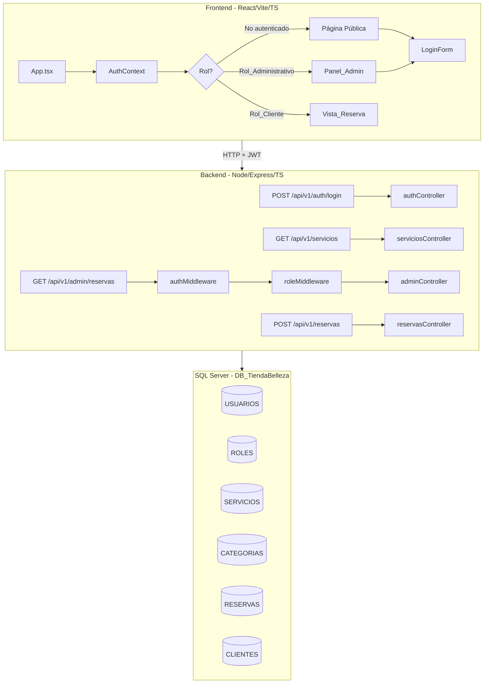
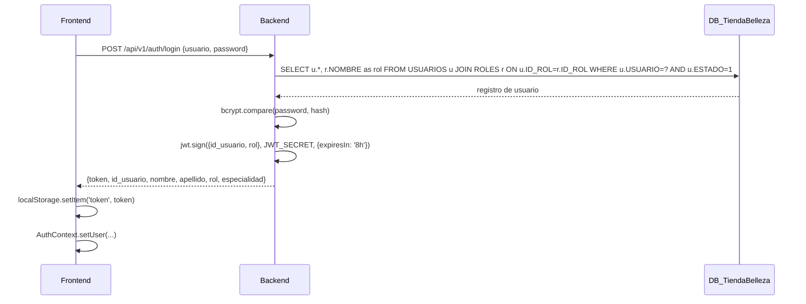

# Diseño Técnico — solarium-db-auth-feature

## Visión General

Esta feature conecta el backend de Solarium a la base de datos real `DB_TiendaBelleza` en SQL Server, agrega autenticación JWT con control de acceso basado en roles, y adapta el frontend para mostrar vistas diferenciadas según el rol del usuario autenticado.

Los tres ejes de trabajo son:

1. **Reconexión a BD**: Actualizar el pool de conexiones para apuntar a `DB_TiendaBelleza` con su esquema real (tablas en mayúsculas: `USUARIOS`, `ROLES`, `SERVICIOS`, `CATEGORIAS`, `RESERVAS`).
2. **Servicios desde BD real**: Adaptar el endpoint `GET /api/v1/servicios` al esquema de `DB_TiendaBelleza`.
3. **Auth + RBAC**: Endpoint de login, generación de JWT, middlewares de autenticación y roles, y frontend con Auth_Context, Login_Form, Panel_Admin y Vista_Reserva.

---

## Arquitectura



### Flujo de autenticación



---

## Componentes e Interfaces

### Backend — Nuevos archivos

```
solarium-api/src/
├── controllers/
│   └── authController.ts        # login handler
├── middleware/
│   ├── authMiddleware.ts         # valida JWT
│   └── roleMiddleware.ts         # verifica rol
├── routes/
│   ├── auth.ts                   # POST /api/v1/auth/login
│   └── admin.ts                  # GET /api/v1/admin/reservas
```

### Backend — Archivos modificados

- `src/db/pool.ts` — cambiar `DB_NAME` default a `DB_TiendaBelleza`
- `src/controllers/serviciosController.ts` — adaptar query al esquema real (`SERVICIOS`, `CATEGORIAS`, `ESTADO`)
- `src/app.ts` — registrar routers `auth` y `admin`
- `.env.example` — agregar `JWT_SECRET`, actualizar `DB_NAME`

### Frontend — Nuevos archivos

```
Solarium/src/
├── context/
│   └── AuthContext.tsx           # React Context + Provider
├── components/
│   ├── LoginForm.tsx             # formulario de login
│   ├── PanelAdmin.tsx            # vista administrativa
│   └── VistaReserva.tsx          # formulario de reserva para clientes
├── hooks/
│   └── useAuth.ts                # hook para consumir AuthContext
```

### Frontend — Archivos modificados

- `src/App.tsx` — envolver en `AuthProvider`, enrutamiento condicional por rol
- `src/components/Navbar.tsx` — agregar botón "Iniciar sesión" / "Cerrar sesión"
- `src/types/api.ts` — agregar tipos `Usuario`, `LoginResponse`, `ReservaAdmin`

### Interfaces TypeScript clave

```typescript
// Backend: src/types/index.ts (adiciones)
export interface UsuarioAuth {
  id_usuario: number;
  nombre: string;
  apellido: string;
  correo: string;
  usuario: string;
  password: string;          // hash bcrypt
  especialidad: string | null;
  estado: number;
  rol: string;               // nombre del rol desde JOIN con ROLES
}

export interface JwtPayload {
  id_usuario: number;
  rol: string;
  iat?: number;
  exp?: number;
}

export interface LoginResponse {
  token: string;
  id_usuario: number;
  nombre: string;
  apellido: string;
  rol: string;
  especialidad: string | null;
}

export interface ReservaAdmin {
  id_reserva: number;
  cliente: string;
  servicio: string;
  empleado: string;
  fecha_reserva: string;
  hora_reserva: string;
  estado: string;
  observacion: string | null;
}

// Frontend: src/types/api.ts (adiciones)
export type AuthUser = {
  id_usuario: number;
  nombre: string;
  apellido: string;
  rol: string;
  especialidad: string | null;
  token: string;
};

export type AuthContextValue = {
  user: AuthUser | null;
  login: (user: AuthUser) => void;
  logout: () => void;
};
```

---

## Modelos de Datos

### Esquema DB_TiendaBelleza (tablas relevantes)

```sql
-- Roles disponibles
ROLES (
  ID_ROL        INT PRIMARY KEY,
  NOMBRE        VARCHAR(50),   -- ADMIN, ESTILISTA, MANICURISTA, RECEPCIONISTA, EMPLEADO
  DESCRIPCION   VARCHAR(200),
  ESTADO        BIT
)

-- Usuarios del sistema (con credenciales)
USUARIOS (
  ID_USUARIO    INT PRIMARY KEY,
  ID_ROL        INT REFERENCES ROLES(ID_ROL),
  NOMBRE        VARCHAR(100),
  APELLIDO      VARCHAR(100),
  TELEFONO      VARCHAR(20),
  CORREO        VARCHAR(150),
  USUARIO       VARCHAR(50) UNIQUE,
  PASSWORD      VARCHAR(255),  -- hash bcrypt
  ESPECIALIDAD  VARCHAR(100),
  ESTADO        BIT,
  FECHA_INGRESO DATE
)

-- Servicios del salón
SERVICIOS (
  ID_SERVICIO       INT PRIMARY KEY,
  ID_CATEGORIA      INT REFERENCES CATEGORIAS(ID_CATEGORIA),
  NOMBRE            VARCHAR(100),
  DESCRIPCION       VARCHAR(500),
  PRECIO            DECIMAL(10,2),
  DURACION_MINUTOS  INT,
  ESTADO            BIT
)

-- Categorías de servicios
CATEGORIAS (
  ID_CATEGORIA  INT PRIMARY KEY,
  NOMBRE        VARCHAR(100),
  DESCRIPCION   VARCHAR(300),
  ESTADO        BIT
)

-- Reservas
RESERVAS (
  ID_RESERVA    INT PRIMARY KEY,
  ID_CLIENTE    INT,
  ID_SERVICIO   INT REFERENCES SERVICIOS(ID_SERVICIO),
  ID_USUARIO    INT REFERENCES USUARIOS(ID_USUARIO),
  FECHA_RESERVA DATE,
  HORA_RESERVA  TIME,
  ESTADO        VARCHAR(20),   -- PENDIENTE, CONFIRMADO, EN_PROCESO, COMPLETADO, CANCELADO
  OBSERVACION   VARCHAR(500)
)
```

### Mapeo de campos: esquema actual → DB_TiendaBelleza

| Tabla actual | Campo actual | Tabla nueva | Campo nuevo |
|---|---|---|---|
| `Servicio` | `id_servicio` | `SERVICIOS` | `ID_SERVICIO` |
| `Servicio` | `activo` | `SERVICIOS` | `ESTADO` |
| `Servicio` | `duracion_min` | `SERVICIOS` | `DURACION_MINUTOS` |
| `Categoria` | `id_categoria` | `CATEGORIAS` | `ID_CATEGORIA` |
| `Categoria` | `activo` | `CATEGORIAS` | `ESTADO` |

### Query adaptada para servicios

```sql
SELECT
  s.ID_SERVICIO    AS id_servicio,
  s.NOMBRE         AS nombre,
  s.DESCRIPCION    AS descripcion,
  s.PRECIO         AS precio,
  s.DURACION_MINUTOS AS duracion_minutos,
  c.NOMBRE         AS categoria
FROM SERVICIOS s
JOIN CATEGORIAS c ON s.ID_CATEGORIA = c.ID_CATEGORIA
WHERE s.ESTADO = 1
ORDER BY s.NOMBRE
```

### Query de login

```sql
SELECT
  u.ID_USUARIO,
  u.NOMBRE,
  u.APELLIDO,
  u.CORREO,
  u.USUARIO,
  u.PASSWORD,
  u.ESPECIALIDAD,
  r.NOMBRE AS ROL
FROM USUARIOS u
JOIN ROLES r ON u.ID_ROL = r.ID_ROL
WHERE u.USUARIO = @usuario
  AND u.ESTADO = 1
```

### Query de reservas del día (admin)

```sql
SELECT
  r.ID_RESERVA                              AS id_reserva,
  c.NOMBRE + ' ' + c.APELLIDO              AS cliente,
  s.NOMBRE                                  AS servicio,
  u.NOMBRE + ' ' + u.APELLIDO              AS empleado,
  CONVERT(VARCHAR, r.FECHA_RESERVA, 23)    AS fecha_reserva,
  CONVERT(VARCHAR, r.HORA_RESERVA, 8)      AS hora_reserva,
  r.ESTADO                                  AS estado,
  r.OBSERVACION                             AS observacion
FROM RESERVAS r
JOIN CLIENTES c  ON r.ID_CLIENTE  = c.ID_CLIENTE
JOIN SERVICIOS s ON r.ID_SERVICIO = s.ID_SERVICIO
JOIN USUARIOS u  ON r.ID_USUARIO  = u.ID_USUARIO
WHERE CAST(r.FECHA_RESERVA AS DATE) = CAST(GETDATE() AS DATE)
ORDER BY r.HORA_RESERVA
```

---

## Propiedades de Corrección

*Una propiedad es una característica o comportamiento que debe mantenerse verdadero en todas las ejecuciones válidas del sistema — esencialmente, una declaración formal sobre lo que el sistema debe hacer. Las propiedades sirven como puente entre las especificaciones legibles por humanos y las garantías de corrección verificables por máquina.*

La librería de property-based testing utilizada es **fast-check** (ya presente en `devDependencies` del backend). Para el frontend se usará **@fast-check/vitest** junto con **vitest**.

### Propiedad 1: Filtrado de servicios activos

*Para cualquier* conjunto de registros en `SERVICIOS` con valores mixtos de `ESTADO`, el endpoint `GET /api/v1/servicios` debe retornar únicamente los registros donde `ESTADO = 1`.

**Valida: Requisito 2.1**

---

### Propiedad 2: Estructura de respuesta de servicios

*Para cualquier* registro de servicio activo en la BD, la respuesta de `GET /api/v1/servicios` debe incluir los campos `id_servicio`, `nombre`, `descripcion`, `precio`, `duracion_minutos` y `categoria` (nombre de categoría obtenido por JOIN).

**Valida: Requisitos 2.2, 2.3**

---

### Propiedad 3: Autenticación solo para usuarios activos

*Para cualquier* conjunto de registros en `USUARIOS` con valores mixtos de `ESTADO`, el endpoint `POST /api/v1/auth/login` debe autenticar exitosamente solo a usuarios con `ESTADO = 1` y credenciales correctas, rechazando con HTTP 401 a usuarios inactivos o con credenciales incorrectas.

**Valida: Requisito 3.2**

---

### Propiedad 4: Estructura del JWT emitido

*Para cualquier* usuario activo que se autentique exitosamente, el Token_JWT retornado debe contener en su payload los campos `id_usuario` y `rol`, y su tiempo de expiración debe ser aproximadamente 8 horas desde el momento de emisión (±60 segundos de tolerancia).

**Valida: Requisitos 3.3, 3.6**

---

### Propiedad 5: Verificación de contraseña con bcrypt

*Para cualquier* contraseña en texto plano, si se genera su hash con bcrypt y se almacena en `USUARIOS.PASSWORD`, entonces el login con esa contraseña debe ser exitoso, y el login con cualquier otra contraseña distinta debe fallar con HTTP 401.

**Valida: Requisito 3.8**

---

### Propiedad 6: authMiddleware extrae y adjunta payload

*Para cualquier* JWT válido firmado con `JWT_SECRET` que contenga `id_usuario` y `rol`, el `authMiddleware` debe adjuntar exactamente esos valores al objeto `request` sin modificarlos.

**Valida: Requisitos 4.1, 4.4**

---

### Propiedad 7: roleMiddleware permite/deniega según rol

*Para cualquier* combinación de rol de usuario y lista de roles permitidos, el `roleMiddleware` debe permitir el acceso (pasar al siguiente middleware) si y solo si el rol del usuario está en la lista de roles permitidos, y retornar HTTP 403 en caso contrario.

**Valida: Requisitos 5.1, 5.2**

---

### Propiedad 8: Botón de login deshabilitado durante solicitud

*Para cualquier* intento de envío del `LoginForm`, el botón de envío debe estar deshabilitado durante todo el tiempo que la solicitud HTTP esté en vuelo, y volver a habilitarse una vez que la solicitud complete (con éxito o error).

**Valida: Requisito 6.3**

---

### Propiedad 9: Persistencia del token en localStorage

*Para cualquier* token JWT recibido tras un login exitoso, el token debe ser almacenado en `localStorage` bajo la clave `token`, y debe poder ser recuperado con el mismo valor sin modificaciones.

**Valida: Requisito 6.5**

---

### Propiedad 10: Restauración de sesión desde localStorage

*Para cualquier* token JWT válido almacenado en `localStorage`, al montar el `AuthProvider` el estado de autenticación debe ser restaurado con los datos del usuario decodificados del token, sin requerir un nuevo login.

**Valida: Requisito 6.7**

---

### Propiedad 11: Enrutamiento condicional por rol

*Para cualquier* usuario autenticado, si su rol pertenece a `Rol_Administrativo` (ADMIN, ESTILISTA, MANICURISTA, RECEPCIONISTA, EMPLEADO) entonces el `App` debe renderizar `Panel_Admin`; si su rol es `Rol_Cliente` entonces debe renderizar `Vista_Reserva`.

**Valida: Requisitos 7.1, 7.2**

---

### Propiedad 12: Estructura de respuesta de reservas admin

*Para cualquier* conjunto de reservas del día en la BD, la respuesta de `GET /api/v1/admin/reservas` debe incluir para cada elemento los campos `id_reserva`, `cliente`, `servicio`, `empleado`, `fecha_reserva`, `hora_reserva`, `estado` y `observacion`.

**Valida: Requisito 8.4**

---

## Manejo de Errores

### Backend

| Situación | Código HTTP | Cuerpo |
|---|---|---|
| `usuario` o `password` ausente en login | 400 | `{ "error": "Los campos usuario y password son requeridos" }` |
| Credenciales inválidas o usuario inactivo | 401 | `{ "error": "Credenciales inválidas" }` |
| Header `Authorization` ausente o mal formado | 401 | `{ "error": "Token requerido" }` |
| JWT expirado o firma inválida | 401 | `{ "error": "Token inválido o expirado" }` |
| Rol insuficiente para el endpoint | 403 | `{ "error": "Acceso denegado: rol insuficiente" }` |
| Error de BD en cualquier endpoint | 500 | `{ "error": "Error interno del servidor" }` |
| Fallo de conexión al iniciar el servidor | — | `process.exit(1)` con log de error |

### Frontend

| Situación | Comportamiento |
|---|---|
| Error en login | Mostrar mensaje de error en `LoginForm` sin recargar |
| Error 401 en endpoint admin | Limpiar `AuthContext` + `localStorage`, redirigir a `LoginForm` |
| Error en carga de servicios | Mostrar `MensajeError` en `SeccionServicios` / `Vista_Reserva` |
| Error al crear reserva | Mostrar mensaje de error en `Vista_Reserva` sin recargar |
| Carga en progreso | Mostrar skeleton en `SeccionServicios`, deshabilitar botón en formularios |

### Seguridad

- Las contraseñas nunca se retornan en ninguna respuesta de la API.
- El JWT no incluye datos sensibles más allá de `id_usuario` y `rol`.
- `JWT_SECRET` se lee exclusivamente desde variable de entorno; no tiene valor por defecto en código.
- Las queries usan parámetros con `mssql` (`.input(...)`) para prevenir SQL injection.
- El token se almacena en `localStorage` (decisión de simplicidad para este proyecto; en producción se evaluaría `httpOnly cookie`).

---

## Estrategia de Testing

### Herramientas

| Capa | Librería |
|---|---|
| Backend — unit/property | **vitest** + **fast-check** (ya en devDependencies) |
| Frontend — unit/property | **vitest** + **@testing-library/react** + **fast-check** |

### Tests de propiedades (property-based)

Cada propiedad del documento se implementa con un único test de propiedad configurado con mínimo **100 iteraciones**. Cada test lleva un comentario de trazabilidad:

```
// Feature: solarium-db-auth-feature, Propiedad N: <texto de la propiedad>
```

**Propiedades a implementar:**

- P1: Filtrado de servicios activos — mock del pool, generar registros con ESTADO mixto
- P2: Estructura de respuesta de servicios — mock del pool, verificar campos presentes
- P3: Autenticación solo para usuarios activos — mock del pool + bcrypt
- P4: Estructura del JWT emitido — generar usuarios aleatorios, verificar payload
- P5: Verificación de contraseña con bcrypt — generar contraseñas aleatorias, hash + compare
- P6: authMiddleware extrae payload — generar JWTs con payloads aleatorios
- P7: roleMiddleware permite/deniega — generar combinaciones de roles y listas permitidas
- P8: Botón deshabilitado durante solicitud — mock fetch con delay, verificar estado del botón
- P9: Persistencia del token en localStorage — generar tokens aleatorios, verificar storage
- P10: Restauración de sesión — generar tokens válidos, montar AuthProvider, verificar estado
- P11: Enrutamiento condicional por rol — generar usuarios con roles aleatorios, verificar render
- P12: Estructura de respuesta de reservas admin — mock del pool, verificar campos

### Tests de ejemplo (example-based)

Cubren los criterios clasificados como EXAMPLE y SMOKE:

- Inicio del servidor: éxito y fallo de conexión a BD
- Endpoint login: campos ausentes (400), credenciales inválidas (401)
- authMiddleware: header ausente, token expirado, firma inválida
- Endpoints públicos accesibles sin token
- LoginForm: render de campos, manejo de error, cierre de sesión
- Panel_Admin: render de secciones, manejo de 401
- Vista_Reserva: render de campos, confirmación de reserva, manejo de error

### Cobertura objetivo

- Todos los criterios de aceptación cubiertos por al menos un test (property o example)
- Middlewares `authMiddleware` y `roleMiddleware` con cobertura de ramas completa
- Controller de auth con cobertura de todos los casos de error
